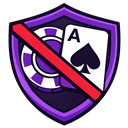

# NoGamble TTV

**Browser extension that hides gambling-promoting streamers from your Twitch experience.**

---

## What it does

- **Hides** blacklisted streamers from the sidebar, browse, homepage, and all recommendations — no empty space left behind
- **Hides** gambling category tiles (Slots, Casino, Roulette, etc.) from the Twitch directory
- **Overlays** a warning when navigating directly to a blacklisted channel or gambling category page
- **ROFUS widget** appears on any stream currently live in a blocked gambling category — links to the Danish self-exclusion register
- **Sidebar widget** shows a count of hidden streamers with a link to the [Wall of Gamblers](https://www.nogamblettv.app/wall)
- **Mutes** the stream while the warning overlay is shown, unmutes if the user chooses to proceed
- Responsive to sidebar collapse, theatre mode, and fullscreen

---

## Tech Stack

| Layer | Technology |
|---|---|
| Framework | [WXT](https://wxt.dev) v0.19 |
| Language | TypeScript (strict) |
| Target | Chrome / Edge (Manifest V3) |
| Blacklist API | [nogamblettv.app/api/blacklist](https://www.nogamblettv.app/api/blacklist) |
| Categories API | [nogamblettv.app/api/categories](https://www.nogamblettv.app/api/categories) |

---

## Roadmap

| Phase | Status | Description |
|---|---|---|
| 1 – Prototype | ✅ Done | Hardcoded blacklist, hide + overlay + ROFUS widget |
| 2 – Remote blacklist | ✅ Done | Live API, admin panel, multi-user, submitted to Chrome Web Store |
| 3 – Community | ✅ Done | Wall of Gamblers, nudge messages, flag submissions |
| 4 – Growth | ✅ Done | Submitted to Chrome Web Store — awaiting listing |

---

## License

MIT — see [LICENSE](LICENSE) for details.
